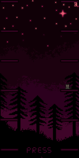

  
### About me 
Hi! I'm a beginner **game developer** passionate about creating simple 2D games using **MonoGame** and C#.  
I enjoy experimenting with gameplay mechanics and graphics while making small projects. I'm also learning React and building frontends.
  
**My main focus:** Game development with C# [MonoGame](https://www.monogame.net/), and frontend using mostly React.

## Skills

  
  
  
  
  
  

## Goals 🎯
- 🕹️ Improve my **game development skills**
- 🏗️ Learn more about **game architecture**
- ⚛️ Learn **Next.js** and improve my React knowledge

## Screenshots 🎮
Here are some screenshots from my projects:  

## Stats 📊
  

## Current Project 🚀

